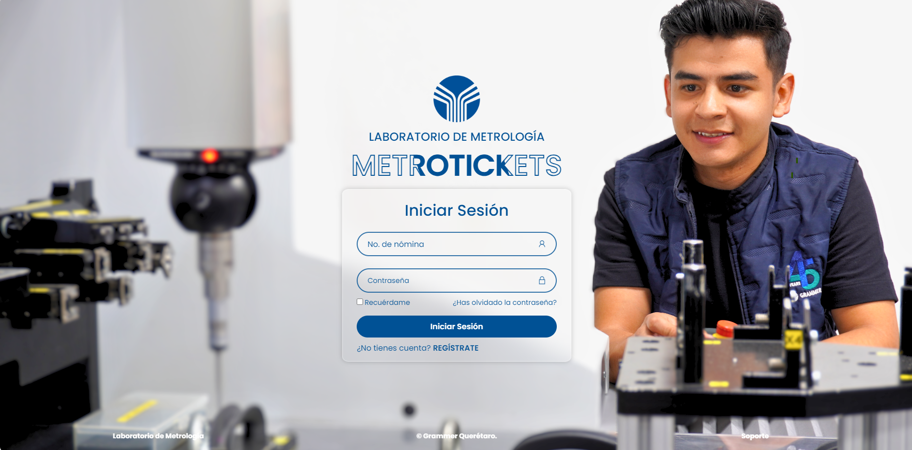
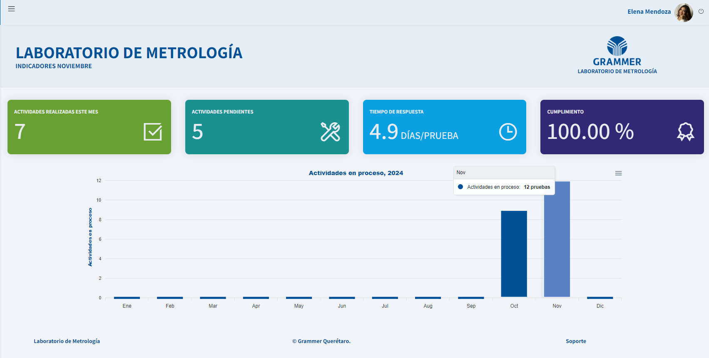
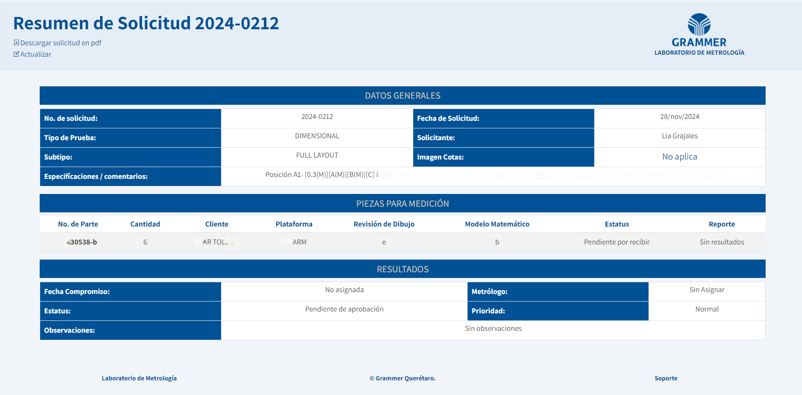
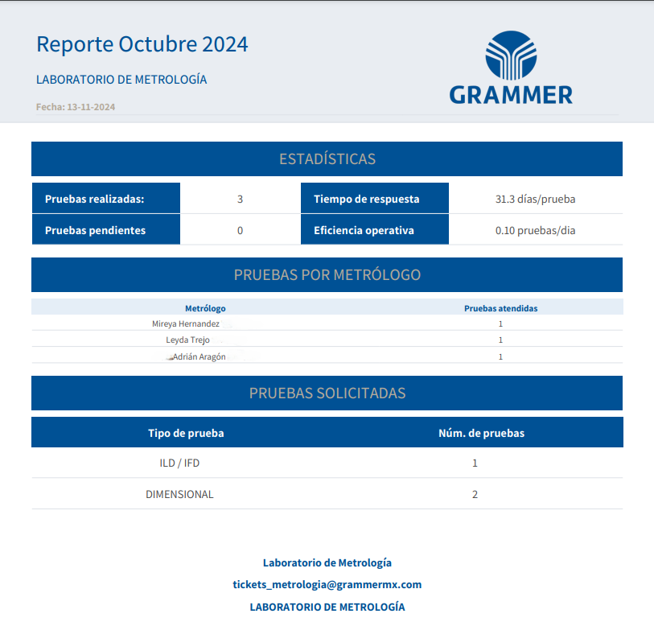

# MetroTickets — Sistema de Gestión de Solicitudes Metrológicas

**MetroTickets** es un sistema web desarrollado para **Grammer Automotive Puebla S.A. de C.V.** para la **gestión, seguimiento y control de pruebas metrológicas**.  
Optimiza la administración de solicitudes y reportes del laboratorio mediante una solución automatizada, segura y centralizada.

Repositorio: https://github.com/ElaRCamo/MetroTickets  
Manual de usuario: [Ver documento oficial](https://grammermx.com/Metrologia/MetroTickets/files/manual/Metrotickets.pdf)

---

## Descripción

MetroTickets permite a los usuarios **registrar, modificar, consultar y cancelar solicitudes** de pruebas metrológicas, brindando trazabilidad completa desde la creación de la solicitud hasta la entrega de resultados.

El sistema incluye:
- **Panel de control** con indicadores visuales, gráficos interactivos y reportes mensuales.  
- **Gestión jerárquica de roles y permisos** (Solicitante, Metrólogo, Administrador).  
- **Notificaciones automáticas por correo electrónico** sobre cambios en el estado de las solicitudes.  
- **Reportes PDF** con resultados y métricas de cumplimiento.  

---

## Funciones principales

- 🧾 **Automatización de solicitudes:** registro, modificación, consulta y cancelación de pruebas.  
- 📊 **Panel de control:** indicadores mensuales, gráficos por tipo de prueba, metrólogo y estado.  
- ✉️ **Notificaciones automáticas:** envío de correos de confirmación y actualización.  
- 🔒 **Gestión de usuarios y roles:** control de acceso seguro con permisos diferenciados.  
- 🧮 **Reportes mensuales:** generación automática en formato PDF.  

---

## Beneficios

- **Eficiencia operativa:** reduce tiempos de procesamiento y elimina tareas manuales.  
- **Reducción de errores:** digitalización confiable y validación de datos.  
- **Trazabilidad completa:** seguimiento detallado de cada solicitud.  
- **Toma de decisiones basada en datos:** métricas y gráficos integrados.  
- **Seguridad:** control de acceso por rol y autenticación por número de nómina.

---

## Roles del sistema

### 🔹 Solicitante
Registra nuevas solicitudes, consulta estatus y descarga reportes en PDF.  
Puede ver su historial completo y cancelar solicitudes si es necesario.

### 🔹 Metrólogo
Gestiona solicitudes asignadas, cambia su estatus (En Proceso, Completado, Rechazado, Finalizado), agrega reportes y fija fechas de compromiso.

### 🔹 Administrador
Accede a indicadores globales, genera reportes mensuales, administra clientes, plataformas y usuarios (alta, edición, desactivación o reasignación de roles).

---

## Requisitos del usuario

- **Navegador moderno:** Chrome, Firefox o Edge actualizados.  
- **Conexión estable a Internet.**  
- **Acceso al correo institucional de Grammer.**  
- Compatible con **escritorio y dispositivos móviles.**

---

## Capturas

- 
- 
- 
- 

---

## Tecnologías

- **Frontend:** PHP, HTML, CSS, JavaScript.  
- **Backend:** PHP + SQL Server.  
- **Reportes:** PDF autogenerados.  
- **Correo electrónico:** notificaciones automáticas (SMTP Grammer).  

---

## Créditos y desarrollo

**Proyecto de Grammer Automotive Puebla S.A. de C.V.**  
**Equipo de desarrollo y colaboración:**
- **Gerardo Ortiz López** — Software Developer T.  
- **Hadbet Ayari Altamirano Martínez** — Programador Jr.  
- **Mariela Reyes Camo** — Practicante TI.  
- **Óscar Gómez** — SQA & Incoming Coordinator Quality.  
- **César Mendoza** y **Christofer** — IT Setters.  
- **José Espejel Villafuerte** — Coordinador TI.  
- **Adrián Aragón** — Quality Technician.

---

## Licencia

**© Grammer Automotive Puebla S.A. de C.V. — Todos los derechos reservados.**  
Este software es de **uso interno y propietario**.  
Queda **prohibida** su copia, modificación, distribución o uso con fines distintos a los autorizados por **Grammer**.  
Para soporte o autorización de uso, contactar al área de **TI** de Grammer.

---

## Contacto y soporte

📧 **Soporte IT Grammer:**  
- hadbet.altamirano@grammer.com  
- gerardo.ortiz@grammer.com  

🌐 **Acceso directo:**  
https://grammermx.com/Metrologia/MetroTickets/

---

## Autoría

Desarrollo original por **Mariela Reyes Camo**, en colaboración con el equipo de **Grammer Automotive Puebla**.
